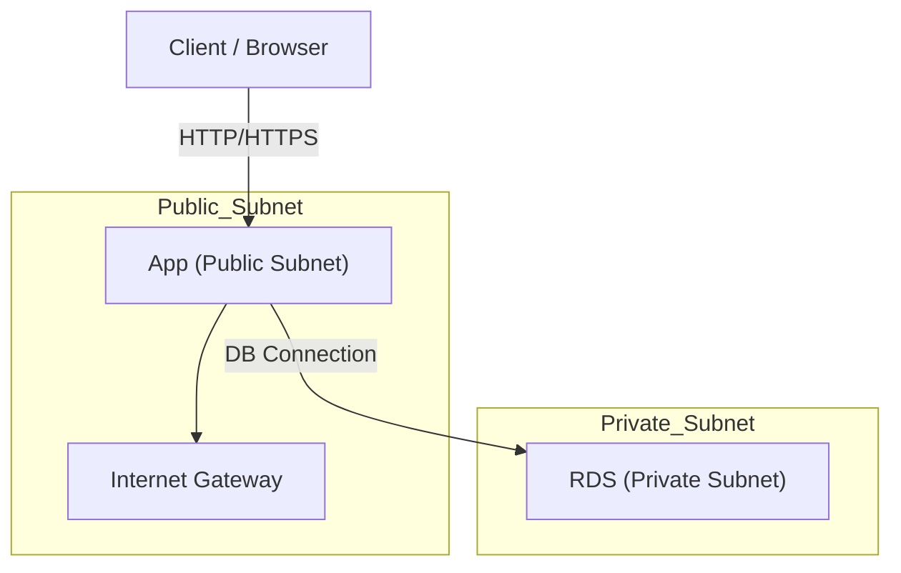

# tech-challenge-2

```mermaid
flowchart TD

    Client["Client / Browser"] -->|HTTP/HTTPS| App["App (Public Subnet)"]
    App -->|DB Connection| DB["RDS (Private Subnet)"]

    subgraph Public_Subnet
        App
        IGW["Internet Gateway"]
    end

    subgraph Private_Subnet
        DB
    end

    App --> IGW
```
