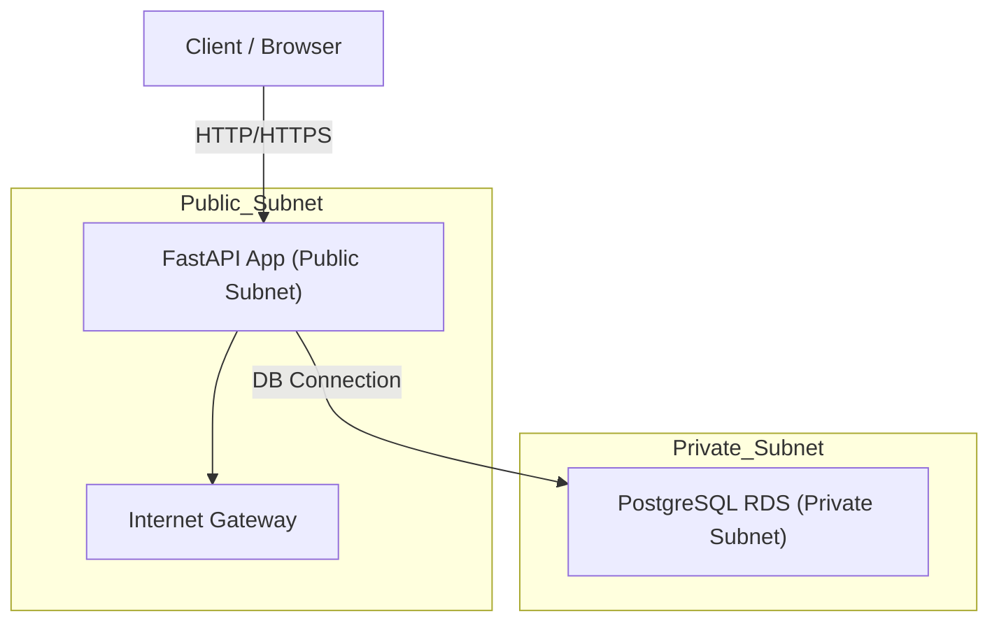
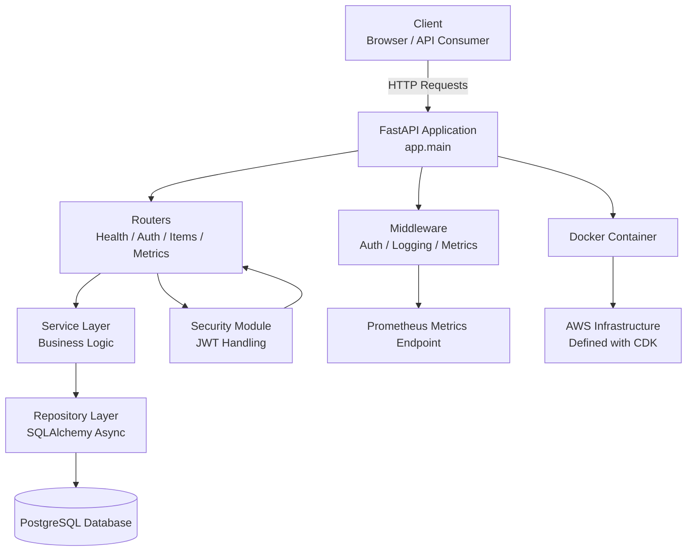

# tech-challenge

A **FastAPI application deployed on AWS** that exposes REST endpoints, health checks, metrics, authentication, and item access-structured with a layered architecture, database integration, and observability tooling.


## Project Overview

This project implements a backend API using **FastAPI**, designed to be scalable, testable, and cloud-ready. It follows modern practices:

- Asynchronous FastAPI server
- PostgreSQL integration using SQLAlchemy with async sessions
- Authentication endpoints (JWT & cookies)
- Health and Liveness checks
- Prometheus metrics support
- Docker + AWS deployment readiness
- Infrastructure defined using AWS CDK (`cdk/` folder)

---

## Features

### API Endpoints

| Endpoint | Method | Description |
|----------|--------|-------------|
| `/health/live` | GET | Liveness check — verifies server is running |
| `/health/ready` | GET | Readiness check — verifies database connectivity |
| `/items` | GET | Returns a list of items (protected route) |
| `/get_token` | POST | Generates a new bearer access token for a user |
| `/get_cookie` | GET | Sets an HTTP-only cookie with a token |
| `/logout` | GET | Clears user session (cookie) |
| `/metrics` | GET | Prometheus metrics endpoint |

---

### Architecture Diagram

## Network Diagram


## Application Diagram


## Tech Stack
| Category       | Technology              |
| -------------- | ----------------------- |
| Framework      | FastAPI                 |
| Python Version | ≥ 3.12                  |
| Async ORM      | SQLAlchemy (asyncio)    |
| ASGI Server    | Uvicorn                 |
| Metrics        | Prometheus              |
| Database       | PostgreSQL              |
| Deployment     | Docker, AWS CDK         |
| Testing        | Pytest + pytest-asyncio |
| Linting        | Ruff                    |

## Running the Application with uv

Prepare an .env file with the following data:
````txt
DATABASE_USER=postgres
DATABASE_PASSWORD=postgres
DATABASE_HOST=localhost
DATABASE_NAME=appdb
LOCAL=true
SECRET_KEY=
````
If you don’t have uv installed:
```bash
pip install uv
```
Or via the official installer:
```bash
curl -Ls https://astral.sh/uv/install.sh | sh
```
Install dependencies
```bash
uv sync
```
Run the application
```bash
uv run uvicorn app.main:app --reload --host 0.0.0.0 --port 8000
```

